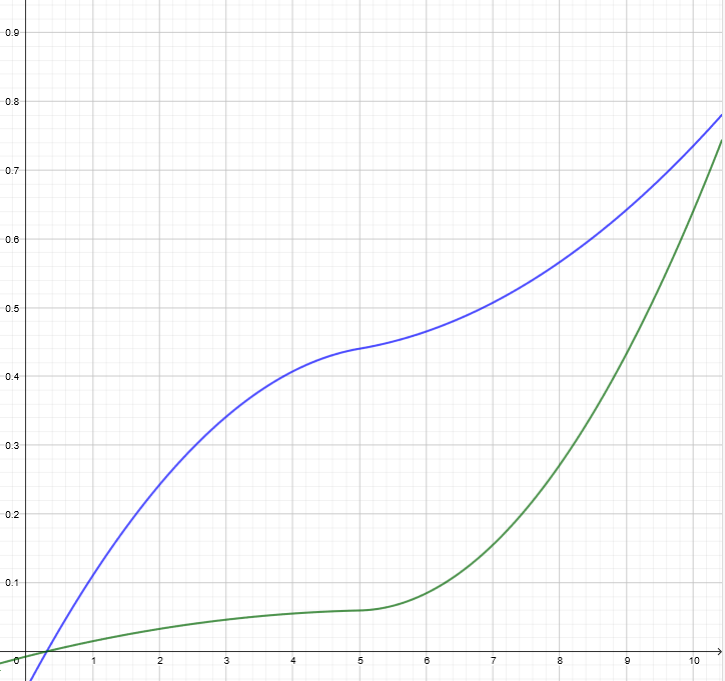
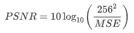

# Image compression using SVD and neural networks

- **Goal**: compress images maintaining an higher quality in areas semantically salient as compared to background regions
- **Algorithm:**
  1. the image is analyzed by a neural network: its outputs is a matrix that highlights semantically-salient regions
  2. the image is divided into smaller parts
  3. on each part of the image the sequentially truncated HOSVD is applied, using a multilinear rank that depends on the values of the importance map

### Input images

- input images are represented thorugh a tensor *T* 
  $$
  T \in \mathbb{F}^{n_1 \times n_2 \times 3}
  $$

- each entry will contain values from 0 to 255

- each slice is associated to a specific color 

## How to obtain the importance of each pixel

We are going to use a convolutional network to obtain, for each pixel, a value between 0 and 1 which represents the importance if that pixel in the image. These values are going to be collected in the *importance matrix*.

### Convolutional neural networks

- particular type of neural network often used in image and video recognition
- divided into layers
- in each layer there are a certain number of feature map, each of those looks for specific patterns in the data

### The network used

- the CNN is trained using the *Caltech-256* dataset, which features images from 256 different classes
- it is not important to obtain a tight bound on the objects: the goal is approximately locate **all** objects
- the output is going to be a 224x224 matrix; each cell will contain a value between 0 and 1 that tries to explain the "importance" of that pixel

### How to compute the importance of each pixel

1. we discard the classes whose learned features do not have a sufficiently large total activation function summed across all features and across the entire image:  
   

2. we compute the multi-structure region of interest as follows:  

### Example of importance matrix
In this images we see, on the left the original image and on the right its corresponding *importance\_matrix*, represented through an heatmap.

  
   

## Going from the importance matrix to the compressed image

**Input:**  importance matrix of each image

**Input:** original image

1. divide the importance matrix into *n\*n* zones
2. for each zone, compute its importance (average of the values of the importance matrix)
3. divide the image into *n\*n* zones
4. compute for each zone the sequentially truncated-HOSVD approximation, choosing a multilinear rank proportional to the importance of that zone

**Output:** compressed image

### Assumptions

In the following calculations, two assumption will be made to simplify the calculations:

- the image is squared
- the size of each side of the image and of the importance matrix (224) are both divisible by *n*

The final code is able to address both 

### The value *q*

-  will be chosen by the user at the beginning of the compression
-  has to be between 1 and 10 (not necessarily integer)
-  influences the size of each zone and the multilinear rank of each zone in the sequentially truncated HOSVD

### The value *n*

- depends on the value of the quality desired

- 

- *q = 10* implies *n = 56*, hence each zone in the importance matrix will be a matrix *4 \* 4*

- *q = 1* implies *n = 8*, hence each zone of the importance matrix will have size *28 \* 28*

### Computation of the importance of each zone

- *k =  224/n(q)*, side of each zone of the importance matrix
- *I_{i,j} =  mean( importance\_matrix( (i-1)\*k +1 : i\*k), (j-1)\*k +1:j\*k )*

The following image represents how the importance of each pixel translates into the way we compute the importance of each zone.

  
   

### Different ways to choose the correct multilinear rank for each zone

We are going to propose two different approaches:

1. proportional to the size of each zone
2. by looking at the singular values of the tensor

Clearly both approaches will take account of the importance of each zone, as well as the value of *q*.

#### First approach: rank proportional to the size of each zone

Properties of the desired function which assign a multilinear rank proportional to the size of each zone:

- with low *q*, the multilinear ranks of all zones had to be small
- as *q* increases, at first only important part have an higher rank, while non-important part maintain a small rank
- with high values of *q*, both the important zones and the less important have a multilinear rank close to half the actual size of the zone

The following image represents a function with these properties:

  
   
   

These images have, on the x-axis the importance of the zone (value between 0 and 1) and in the y-axis the ratio between the rank in the SVD and the size of the image.  

The goal of the algorithm is to have an higher quality in zones with higher value of the importance matrix:\

Let 

then, the value of the rank assigned to zone *(i, j)* is going to be the following: 

This function has two important properties: the ratio between rank of the most important zones and the size *m*, as well as the ratio between the rank of the least important zones and *m*, are increasing functions. This means that the overall visual quality of both important zones and least important zones is increasing as q increases.  

In the following graph, in blue is represented the first ratio, while in green is the other one.

  

#### Second approach: rank obtained by looking at the singular values of the tensor

First, we need to look at the singular values and choose an appropriate target rank for the core tensor:  will be considered only singular values which are higher than the smallest of the third dimension, where we have to mantain the same dimension. 

The image below is a representation of the singular values of one zone in a test image; the results would be very similar with all the zones. On the right we have a visual representation of the singular values we are going to choose.

  

To obtain the final size of the tensor rank for each zone:

where *optimal\_rank* represents the vector of size 3 containing the number of singular values which are higher than the smallest of the third dimension.

### Compression of the image

1. we need to divide the image into $n \times n$ zones; each one will correspond to one in the importance matrix
2. each zone can be represented through a tensor of size *m \* m \* 3* with *m= (image\_size)/n*
3. we compute the approximation of the tensor of each zone, using sequentially truncated HOSVD on each zone setting a target multilinear rank of *(rank(i, j), rank(i,j), 3)*

In the following images we can see:
- in the first row, the original image and the heatmap representation of its importance matrix
- in the second row, the image compressed with quality 1 (left) and 5 (right)
- in the last row, the image compressed with quality 8 (left) and 10 (right)

  
   

  
   

  
   

## Results analysis

We are now going to compare the performances of the two different methods using different qualities measures. The example dataset is going to be the *Kodak dataset*, which contains images of both natural and man-made objects, as well as people. The images are going to be of every shape.

  
  
  

### Measure 1: Peak signal-to-noise ratio (PSNR)

Given two images, the original (O) and the compressed (C), both represented as tensors in *n1 \* n2 \* 3*

The value is going to be 

  

where 

  

### Structural similarity index measure (SSIM)

Based on the idea that the pixels have strong inter-dependencies when they are spatially close. The SSIM index is calculated on various windows of an image. The measure between two windows x (in the original image) and y (in the compressed one) of common size N×N is defined as

  

with 

  

It is a value between -1 and 1, with 1 indicating two identical images, 0 indicates no structural similarities.

#### PSNR-HVS-M

It is an extension of PSNR, which also takes account of elements of the human vision system. It is based on a modified version of the MSE. More details can be found at **LINK PSNR-HVS-M**

### Alternative methods of compression

We are going to compare the two algorithm presented before with two additional ones.  

The first one is a *naive ST-HOSVD compression*, where we simply compute the sequentially truncated HOSVD on an image, imposing a multilinear rank that will depend on the rate of compression desired. So, we are not going to consider the importance of each zone and the importance matrix won't be computed.

The other algorithm considered is the JPEG algorithm.

### Results

Running the four algorithms on the images in the *Kodak dataset*, the following results were obtained. In order to have similar compression rates, different values of the

| Algorithm | Compr. rate | Execution time | PSNR    | SSIM   | PSNR-HVS-M |
| --------- | ----------- | -------------- | ------- | ------ | ---------- |
| Naive     | 0.8670      | 0.2818 s       | 33.9548 | 0.7722 | 27.4183    |
| ROI (1)   | 0.8681      | 1.1668 s       | 36.4481 | 0.9044 | 30.2450    |
| ROI (2)   | 0.8665      | 1.7397 s       | 36.7294 | 0.9050 | 32.4847    |
| JPEG      | 0.8686      | 0.3358 s       | 36.9240 | 0.9106 | 43.0126    |

It can be observed that the algorithm based on the ROIs have (slightly) better performances in the zones of higher importance, however on the whole image the JPEG still has much better performances.

## Possible improvements

- improve the neural network
- optimize the neural network in order to make it work better with rectangular images
- parallelization of the ST-HOSVD on the different zones, in order to reduce the execution time

## References

- Aaditya Prakash, Nick Moran, Solomon Garber, Antonella DiLillo,and James A. Storer. Semantic perceptual image compression using deep convolutionnetworks. CoRR, abs/1612.08712, 2016
- Vervliet N., Debals O., Sorber L., Van Barel M. and De Lathauwer L. *Tensorlab 3.0*, Available online, Mar. 2016. URL:[https://www.tensorlab.net/](https://www.tensorlab.net/external/tensorlab.txt)

